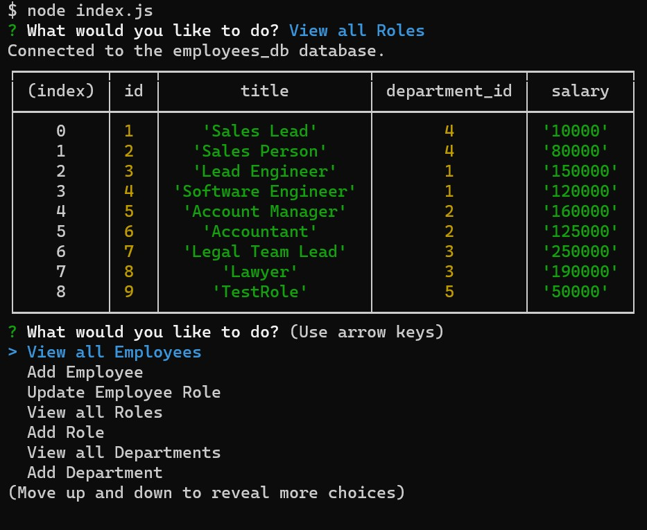

# SQL Challenge: Employee Tracker

## Description
Develop a command line application to manage a company's employee database. Technologies used for this project are Node.js, MySQL, and Inquierer to build the back end of the application

## Here's what the application looks like:


## Video
Here's a walkthrough of the application [Video](https://drive.google.com/file/d/1L1VVecyn5ftMQAFDT1pGCKO0kkcKFgWd/view)

## Link to repository:
[Github](https://github.com/DiegoABorjas/12-employee-tracker)


## User Story
```
AS A business owner
I WANT to be able to view and manage the departments, roles, and employees in my company
SO THAT I can organize and plan my business
```

## Acceptance Criteria
```
GIVEN a command-line application that accepts user input
WHEN I start the application
THEN I am presented with the following options: view all departments, view all roles, view all employees, add a department, add a role, add an employee, and update an employee role
WHEN I choose to view all departments
THEN I am presented with a formatted table showing department names and department ids
WHEN I choose to view all roles
THEN I am presented with the job title, role id, the department that role belongs to, and the salary for that role
WHEN I choose to view all employees
THEN I am presented with a formatted table showing employee data, including employee ids, first names, last names, job titles, departments, salaries, and managers that the employees report to
WHEN I choose to add a department
THEN I am prompted to enter the name of the department and that department is added to the database
WHEN I choose to add a role
THEN I am prompted to enter the name, salary, and department for the role and that role is added to the database
WHEN I choose to add an employee
THEN I am prompted to enter the employee’s first name, last name, role, and manager, and that employee is added to the database
WHEN I choose to update an employee role
THEN I am prompted to select an employee to update and their new role and this information is updated in the database
```

## Installation

To install necessary dependencies, run:
```
npm i
```
## Usage

Run node index.js to start running the application

---

## Questions
If you have any questions about the repo, open an issue or contact me directly at diegoborjas@gmail.com. You can find more
of my work at [diegoaborjas](https://github.com/diegoaborjas)